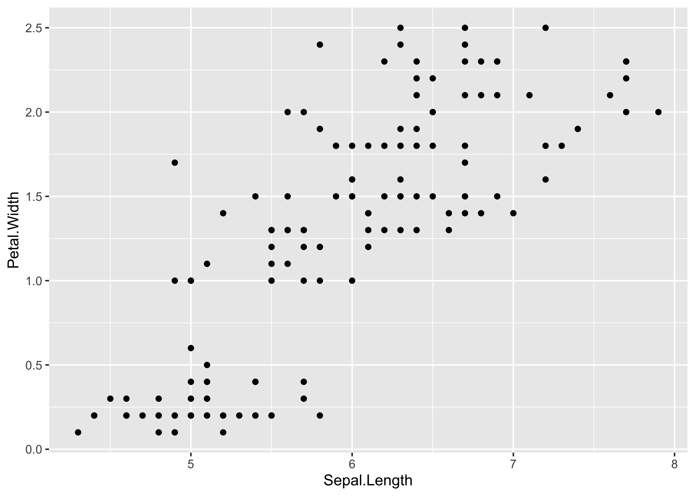

# ggProfessional 

## Overview

Based on my several years of experience in the research, the private and
the public sector, this package is helpful for those who regularly use
the {ggplot2} package to perform their daily institutional tasks.

`ggProfessional` helps you with:

- exporting all your plots

- manage themes and palettes

- add your logo or watermark to the figures

## Installation

`ggProfessional` is not available in the CRAN, since it does not satisfy
the requirements (saves into your wd, creates global variables to work
with `gg` elements), and it is built on packages that are not available
on CRAN.

``` r
install.packages("devtools")
devtools::install_github("MarcellGranat/ggProfessional")
```

## Usage

### Export

As you load the package, two functions are immediately assigned to your
global environment: `-` & `.gg_finalise` (hidden).

``` r
library(ggProfessional)
```

``` r
ls()
#> [1] "-.gg"
```

`-.gg` is taken from the following [SW
solution](https://stackoverflow.com/questions/40637088/how-to-pipe-forward-a-ggplot-object).
It allows you to use a function on a gg object, without assigning in. I
recommend you to add `- .gg_finalise` to all your gg code blocks at the
end, by default it will return the plot, without any modification, but
if you later update the `.gg_finalise` function, you can specify your
saving method, and it will be used to all your figures.

Combine this with the plot_to<filetype> functions from the package,
helps you in the situations when you have to share your figures also in
ppt/excel/csv.

``` r
library(ggplot2)

ggplot(iris, aes(Sepal.Length, Petal.Width)) + 
  geom_point() - # <
  .gg_finalise # no brackets!
```

<!-- -->

``` r
.gg_finalise <<- function(plot = ggplot2::last_plot()) {
  plot_to_ppt(plot) # save all plots into one ppt file
  plot_to_excel(plot) # save all plots into one excel file (as table)
  plot_to_csv(plot) # save all plots into separate csv files (as table)
  plot
  }
```


### Manage themes and palettes

Set theme for ggplot figures was already built in the `{ggplot2}`
package. In this field I can only extend that with the
`register_theme`/`available_themes`/`get_theme` functions. This help you
to save your theme and reuse that in all of your projects.

``` r
register_theme(ggplot2::theme_bw() + theme(title = element_text(color = "red")), name = "rbw")
register_theme(ggplot2::theme_bw() + theme(title = element_text(color = "green")), name = "gbw")
```

``` r
available_themes()
```

<!-- -->

``` r
register_palette(c("red1", "red2", "steelblue", "blue2", "green", "yellow", "#FF6F91"), name = "first")
register_palette(c("blue", "purple", "cyan", "blue2", "orange", "yellow", "#FF6F91"), name = "sec")
```

``` r
available_palettes()
```

<!-- -->

``` r
remove_palette("first")
remove_palette("sec")
```

Similarly you have these functions for palettes. But `set_palette` will
create a `.co` hidden function that helps you to easily use your own
palette (e.g. .co(1:2) returns the first two colors in your palette, but
you can also use named colors.). `set_palette` can also register the
colors as default.

### Logos

You can register your institutional logos (saved only locally) and reuse
in every project.

``` r
register_logo(path = "logo.png", "ggp") # example
#> [1] TRUE

ggplot(iris, aes(Sepal.Length, Petal.Width)) + 
  geom_point() +
  watermark_logo("ggp", alpha = .2)
```

<!-- -->

``` r
ggplot(iris, aes(Sepal.Length, Petal.Width)) + 
  geom_point() -
  corner_logo
```

<!-- -->
